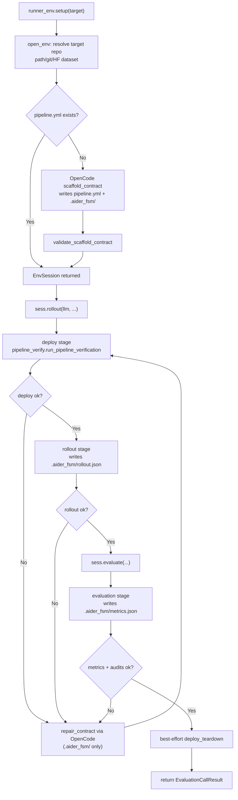

# OpenCode-FSM Runner

A small, auditable **benchmark-agnostic** library for deploying and validating target repos via a repo-owned contract (`pipeline.yml` + `.aider_fsm/`).

中文：这是一个“目标仓库自带合同（pipeline.yml + .aider_fsm）”的通用执行与验收库。Runner 自身不写 benchmark-specific 逻辑。

## Install

Install OpenCode (CLI) first:

```bash
curl -fsSL https://opencode.ai/install | bash
```

```bash
python3.12 -m venv .venv
source .venv/bin/activate
pip install -r requirements.txt
```

## Environment variables

- Provider credentials depend on your model choice, e.g.:
  - `OPENAI_API_KEY` (for `openai/...`)
  - `OPENAI_API_BASE` (optional; for OpenAI-compatible endpoints)
- OpenCode server auth (optional, if you use `opencode_url` in code):
  - `OPENCODE_SERVER_USERNAME`
  - `OPENCODE_SERVER_PASSWORD`

## Programmatic API (library)

Only supported entrypoints:

```python
import runner_env

sess = runner_env.setup("https://github.com/<owner>/<repo>")
sess.rollout(llm="deepseek-v3.2", mode="smoke", require_samples=True, repair_iters=0)
res = sess.evaluate(mode="smoke", repair_iters=0)
print(res.ok, res.metrics)
```

Notes:

- `sess.rollout()` requires an explicit `llm=...` (remote model id/name, or a local model dir path).
- `sess.evaluate()` can reuse the session LLM from `rollout()`, or accept `llm=...` as a convenience (for one-shot runs).
- `sess.evaluate()` performs a best-effort teardown automatically at the end (no public teardown API).

## Flow (high-level)

中文说明：整体运行流程是“以目标仓库自带合同为准”的闭环执行。你通过 `runner_env.setup(target)` 传入一个 repo URL/本地路径（或 HF 数据集快照）后，runner 会先解析/打开目标环境并尝试加载 `pipeline.yml`；如果目标仓库缺少 `pipeline.yml`，会调用 OpenCode 生成最小可运行的 scaffold 合同（写入 `pipeline.yml` 与 `.aider_fsm/` 目录）并做基本校验。随后返回 `EnvSession`，`sess.rollout(llm, ...)` 会按合同执行 deploy（可先跑 `.aider_fsm/bootstrap.yml` 做环境准备）并要求 deploy 写出 `.aider_fsm/runtime_env.json`，再执行 rollout 并写出 `.aider_fsm/rollout.json`（需要时包含 samples JSONL）；任何阶段失败时会进入“repair 重试”循环：runner 触发 OpenCode 只在 `.aider_fsm/` 下修复脚本/配置并重新验证。最后 `sess.evaluate(...)` 按合同运行 evaluation/benchmark 并写出 `.aider_fsm/metrics.json`（必要时还要生成 `.aider_fsm/hints_used.json` 证明执行过官方命令），验证通过后做 best-effort 的 deploy teardown。整个过程中 runner 会把每次 attempt 的 stdout/stderr、验证结果与 provenance 证据落盘到 `.aider_fsm/artifacts/<run_id>/...`，以便审计与复现。



## `.aider_fsm/` contract files (target repo)

中文说明：`.aider_fsm/` 是目标仓库的“合同工作区”。合同的输入（脚本/配置）与输出（JSON 结果与证据）都尽量落在这个目录里，方便 runner 做验收、审计与复现。

Stage 脚本（通常会被 `pipeline.yml` 直接调用）：

- `.aider_fsm/stages/tests.sh`: 运行目标仓库的测试（或最小自检），用于 `tests` stage。
- `.aider_fsm/stages/deploy_setup.sh`: 启动服务/准备运行环境；应写出 `.aider_fsm/runtime_env.json`（JSON object）。
- `.aider_fsm/stages/deploy_health.sh`: 健康检查；应读取并验证 `.aider_fsm/runtime_env.json` 指向的服务是否可用。
- `.aider_fsm/stages/deploy_teardown.sh`: 停止服务/清理资源；建议幂等（重复执行也安全）。
- `.aider_fsm/stages/rollout.sh`: 产生 rollout 产物；应写出 `.aider_fsm/rollout.json`（并在需要时生成 samples JSONL）。
- `.aider_fsm/stages/evaluation.sh`: 产生评测指标；应写出 `.aider_fsm/metrics.json`（或 `pipeline.yml` 指定的 metrics_path）。
- `.aider_fsm/stages/benchmark.sh`: 可选的基准跑分 stage；若启用，应写出对应的 metrics JSON。

配置文件（可选，repo-owned）：

- `.aider_fsm/bootstrap.yml`: 环境准备步骤（如创建 venv、安装依赖、预热缓存）。注意：不要把 `pytest/benchmark` 之类的“评测/测试运行”放到 bootstrap 里，应该放在 pipeline stages。
- `.aider_fsm/actions.yml`: 一次性“动作清单”（例如写入 `.env`、安装依赖、warmup）。runner 会按顺序执行并落盘证据，结束后会 best-effort 删除该文件。

运行输出（run-generated，通常不建议提交到 git）：

- `.aider_fsm/runtime_env.json`: deploy 输出的运行时连接信息（例如 `inference.openai_base_url/base_url`、`inference.model`、`service.base_url` 等）。runner 会用它做 best-effort 的推理端点/模型推断，并把其路径通过 `AIDER_RUNTIME_ENV_PATH` 暴露给后续 stage。
- `.aider_fsm/rollout.json`: rollout 输出的 JSON 对象；推荐包含 `paths.samples_jsonl` 指向样本 JSONL（每行含 `prompt/completion/reward`）。
- `.aider_fsm/metrics.json`: evaluation/benchmark 输出的指标 JSON；当 pipeline 要求 `required_keys` 时 runner 会做键存在性校验；若包含 `ok`，还会要求 `ok=true`（避免“占位成功”）。
- `.aider_fsm/hints_used.json`: 当存在 doc/CI hints 且 `AIDER_FSM_REQUIRE_HINTS=1` 时要求写出，用于证明“至少运行过一个官方/提示命令”（含 `ok/used_anchors/commands/reason`）。
- `.aider_fsm/hints_run.json`: hints 执行的调试追踪（可选但强烈建议保留），用于定位为什么某些 hints 失败/被跳过。

证据目录（runner-managed）：

- `.aider_fsm/artifacts/<run_id>/...`: 每次运行的可审计证据（stdout/stderr、stage summary、验证结果等）。库 API 默认写在 `.aider_fsm/artifacts/<run_id>/env_api/**`。
- `.aider_fsm/artifacts/*/scaffold/scaffold_provenance.json`: scaffold 合同的溯源报告（哪些合同文件被写入/修改、来源是谁）。
- `.aider_fsm/artifacts/*/repair_*/repair_provenance.json`: repair 合同的溯源报告（若发生 repair）。
- `.aider_fsm/venv/`:（可选）推荐的 repo 内隔离虚拟环境目录，通常由 `.aider_fsm/bootstrap.yml` 创建并通过 `PATH` 覆盖让后续 stage 使用该环境。

## OpenCode server (optional)

Start a server in your target repo root:

```bash
OPENCODE_SERVER_PASSWORD=... opencode serve --hostname 127.0.0.1 --port 4096
```

Then point `setup()` at it:

```python
import runner_env

sess = runner_env.setup(
    "https://github.com/<owner>/<repo>",
    opencode_url="http://127.0.0.1:4096",
    opencode_model="opencode/gpt-5-nano",
)
```

## Docs

- `docs/README.md` (中文索引)
- `docs/overview.md`
- `docs/env_api.md`
- `docs/pipeline_spec.md`
- `docs/bootstrap_spec.md`
- `docs/metrics_schema.md`
- `docs/security_model.md`
- `docs/integration.md`
- `docs/verification.md`

## Tests

```bash
pytest -q
```

## 常见问题（FAQ）

1. 问：我只有一个目标仓库 URL（没有 `pipeline.yml`），最少需要做什么才能让 `runner_env.setup()` 自动跑起来？哪些情况下必须手动补合同？

   答：最少需要满足两点：`opencode` 可用（用于 scaffold/repair）以及目标仓库能在非交互环境下跑通“最小合同闭环”。在缺少 `pipeline.yml` 时，`setup()` 会调用 OpenCode 生成 `pipeline.yml` 与 `.aider_fsm/`（stage 脚本/配置），随后 runner 会验证这些脚本是否存在、是否可执行、以及是否能产出必需的 JSON 产物。若目标仓库缺少可参考的“官方命令”（README/CI）或必须交互登录/手动步骤，OpenCode 往往无法可靠生成可跑合同，这时建议你手动从 `examples/pipeline.benchmark_skeleton.yml` 起步并补齐 `.aider_fsm/stages/*.sh`（参考：`docs/integration.md`、`docs/pipeline_spec.md`）。

2. 问：`strict_opencode=True` 到底意味着什么？runner 和 OpenCode 各自允许改哪些文件，失败时为什么会拒绝通过？

   答：`strict_opencode=True` 的核心是“合同只能由目标仓库或 OpenCode 产生/修复，runner 不代写合同”。在 scaffold/repair 时，允许被修改的范围是 `pipeline.yml` 与 `.aider_fsm/**`，并且会记录 provenance（溯源证据）到 `.aider_fsm/artifacts/*/scaffold/*` 或 `.aider_fsm/artifacts/*/repair_*/*`。拒绝通过通常来自三类原因：写文件越界（试图改 repo 其他文件）、合同不完整（缺脚本/缺产物）、或 evaluation 脚本被审计判定为“伪评测”（例如硬编码非零分、未执行任何真实命令）。

3. 问：`.aider_fsm/` 目录里哪些文件应该提交到 git，哪些不该提交？推荐的 `.gitignore` 是什么？

   答：建议提交“合同输入”，不要提交“运行输出/证据/环境”。通常应提交：`pipeline.yml`、`.aider_fsm/stages/*.sh`、（可选）`.aider_fsm/bootstrap.yml`。通常不建议提交：`.aider_fsm/artifacts/`、`.aider_fsm/venv*/`、`.aider_fsm/runtime_env.json`、`.aider_fsm/rollout.json`、`.aider_fsm/metrics.json`、`.aider_fsm/hints_*.json`、`.aider_fsm/actions.yml`（一次性动作清单，runner 会 best-effort 删除）。可参考如下忽略规则：

   ```gitignore
   .aider_fsm/artifacts/
   .aider_fsm/venv*/
   .aider_fsm/runtime_env.json
   .aider_fsm/rollout.json
   .aider_fsm/metrics.json
   .aider_fsm/hints_*.json
   .aider_fsm/actions.yml
   ```

4. 问：一次完整的 `setup -> rollout -> evaluate` 会按什么顺序执行哪些 stage？每一步成功/失败的判定依据是什么？

   答：`setup()` 负责打开目标仓库（本地路径/git/HF snapshot）并确保合同存在；缺 `pipeline.yml` 时会 scaffold 并校验。`sess.rollout()` 按合同执行 deploy（可选 bootstrap）→ rollout，要求写出 `.aider_fsm/rollout.json`（需要样本时还要有 samples JSONL）。`sess.evaluate()` 会优先走“复用已存在 runtime_env 的快速路径”（只跑 evaluation），否则会跑完整 deploy → rollout → evaluation；evaluation 需要写出 `metrics_path` 指向的 JSON 并满足 `required_keys`（常见要求 `ok` 与 `score`），同时可能触发 evaluation 脚本审计与 hints 证明。任一环节不满足合同或审计即失败，并进入 repair 重试（在 `repair_iters` 次数内）。

5. 问：`deploy_setup.sh` 为什么必须写 `.aider_fsm/runtime_env.json`？这个 JSON 最少要包含哪些字段，runner 会读取哪些键？

   答：`runtime_env.json` 是“把 deploy 产出的运行时信息传给后续 stage”的统一通道，路径会通过 `AIDER_RUNTIME_ENV_PATH` 注入给脚本。runner 会 best-effort 读取其中的推理端点/模型信息来填充 OpenAI 兼容环境变量：优先读 `inference.openai_base_url`/`inference.base_url` 与 `inference.model`，否则读 `service.base_url`。如果你的合同不依赖这些字段，也建议至少写一个 JSON object 文件（哪怕只含最小字段），避免脚本侧找不到文件。

6. 问：我不需要 deploy（比如纯离线评测），能不能把 deploy 关掉？`pipeline.yml` 里怎么写最小化合同？

   答：可以。做法是把 deploy 相关命令设为 no-op（或直接不配置 deploy 字段），并让后续 stage 不依赖服务侧信息。由于公共 API 的编排会在需要时尝试 deploy（尤其在首次 evaluate 需要走完整闭环时），最稳妥的方式是在 `.aider_fsm/stages/deploy_setup.sh` 写一个“直接落盘最小 `runtime_env.json` + 退出 0”的脚本，同时保证 rollout/evaluation 纯本地可运行。最小合同建议从 `examples/pipeline.example.yml` 或 `examples/pipeline.benchmark_skeleton.yml` 精简，并参考 `docs/pipeline_spec.md`。

7. 问：`rollout.json` 的最小 schema 是什么？如果我想做 RL 样本采集，`samples.jsonl` 每行必须有哪些字段，runner 会做哪些校验？

   答：最小要求是 `.aider_fsm/rollout.json` 为 JSON object；做 RL 样本采集时建议包含 `paths.samples_jsonl` 指向一个 JSONL 文件。每行最少包含 `prompt`（string）、`completion`（string）、`reward`（number）。当 `require_samples=True` 时 runner 会校验 samples 文件存在、每行可解析且字段类型正确，并做一些通用 sanity checks（例如 completion 全空、errors 计数异常等）。详见：`docs/env_api.md`、`docs/metrics_schema.md`。

8. 问：`metrics.json` 里 `ok` 和 `score` 的语义是什么？为什么 runner 要求 `ok=true` 才算通过，这和“测试全过”有什么区别？

   答：`ok` 表示“确实完成了一次真实评测并产出可信分数”，`score` 是数值指标（主 KPI）。runner 要求 `ok=true` 是为了防止合同脚本写一个“占位成功” JSON 就通过（例如完全不跑评测、直接写 `score=1.0`）。这与“测试全过”不同：测试只证明代码不报错，不等价于 benchmark 指标有效；因此建议 evaluation/benchmark stage 明确产出指标并在 artifacts 中保留证据。

9. 问：runner 从 README/CI 抽取 hints 的规则是什么？`hints_used.json` 为什么在某些模式下必须存在，它具体要证明什么？

   答：runner 会从目标仓库的 README/docs/CI workflows 等来源提取高置信“官方命令”（例如 `pytest -q`、`make test`、`npm test`），并注入到 `AIDER_FSM_HINTS_JSON` 与 `AIDER_FSM_HINT_ANCHORS_JSON`。当检测到 hints 时，runner 会要求 evaluation 至少运行过一个 hinted 命令，并写出 `.aider_fsm/hints_used.json` 来证明“评测不是凭空捏造”：其中 `used_anchors` 用于验证确实命中了这些官方命令的关键信号。详见：`docs/env_api.md`、`docs/verification.md`。

10. 问：我的评测命令需要交互（登录、OTP、下载私有模型等），`--unattended strict` 会拦截哪些行为？什么时候应该用 `guided`？

   答：`unattended=strict` 会设置 `CI=1`、`GIT_TERMINAL_PROMPT=0` 等并阻止“疑似交互式”的命令（例如没有非交互参数的登录命令），避免无人值守卡死。只有当你明确需要人工输入（例如一次性登录）时才考虑 `guided`；更推荐把登录信息改为非交互（token/env/预先缓存）或放在受控的 `auth` stage，并在 artifacts 留痕。详见：`docs/security_model.md`、`docs/pipeline_spec.md`。

11. 问：OpenCode 本地 server 和直接用 CLI scaffold/repair 有什么差别？我应该什么时候配置 `opencode_url/opencode_model`？

   答：本地/远端 OpenCode server（`opencode_url=...`）通常更适合长任务与多轮 repair（会话更稳定、便于复用上下文），也便于在受限环境里统一做认证与资源隔离；直接 CLI 更适合一次性运行或本机简单场景。若你希望 runner 连接既有的 OpenCode 服务、或需要更可控的模型选择与超时重试策略，建议显式配置 `opencode_url` 与 `opencode_model`（见 README 的 OpenCode server 示例）。

12. 问：出现失败时，怎么定位问题发生在哪个阶段？我应该优先看 `.aider_fsm/artifacts/<run_id>/` 里的哪些文件？

   答：优先看 `verify.failed_stage`（在 `EvaluationCallResult.verify`/`RolloutCallResult.verify` 中），然后到对应 attempt 的 artifacts 目录下查看：每个 stage 会落盘 `<stage>_summary.json`，以及 `<stage>_cmdXX_tryYY_*` 的 stdout/stderr/result；另外如果是合同/审计问题，常会额外生成如 `metrics_contract_error.txt`、`evaluation_audit_error.txt`、`rollout_contract_error.txt` 等提示文件。详见：`docs/verification.md`。

13. 问：repair 循环为什么可能反复失败？我如何让修复更容易成功？

   答：常见原因包括：依赖安装不可复现（缺 bootstrap/网络不稳定）、命令需要交互（strict 模式被拦截）、安全策略阻止命令、脚本没有按合同写出必需 JSON、或 evaluation 被审计判定为“无真实执行/硬编码得分”。建议做三件事：把环境准备放进 `.aider_fsm/bootstrap.yml`（确定性、非交互）、让 stage 脚本严格“落盘产物 + 明确退出码”、并在 artifacts 中保留可审计证据（不要吞 stdout/stderr）。必要时把复杂逻辑放到 `.aider_fsm/stages/*.sh`，保持 `pipeline.yml` 简单稳定。

14. 问：安全策略会阻止哪些命令？如果我的 benchmark 必须用 docker/kubectl/系统命令，怎么在安全边界内配置可用？

   答：runner 有 hard deny（永远阻止）与 `security.mode=safe/system` 两层策略；`safe` 会额外阻止一批高风险系统命令。若确实需要 docker/kubectl 等，你可以在 `pipeline.yml` 里切到 `security.mode: system`，并用 `security.allowlist/denylist` 精确收敛允许的命令集合，同时确保 teardown 幂等、资源可回收。详见：`docs/security_model.md`、`docs/pipeline_spec.md`。

15. 问：我想把 runner 集成进训练脚本/CI：如何设置模型与超时，才能做到稳定、可复现、可审计的自动化运行？

   答：建议至少配置：远端推理用 `OPENAI_API_KEY`（以及可选 `OPENAI_API_BASE/OPENAI_BASE_URL`），并在 `sess.rollout(llm=...)` 明确指定 `llm`；规模控制用 `AIDER_EVAL_LIMIT`；长任务超时可用 `AIDER_FSM_MAX_CMD_SECONDS` / `AIDER_FSM_MAX_TOTAL_SECONDS` 做运行时覆盖；OpenCode 侧用 `opencode_timeout_seconds` 与 `opencode_retry_attempts` 提升 scaffold/repair 稳定性。把依赖安装写进 `.aider_fsm/bootstrap.yml`，把关键输出写进 `.aider_fsm/rollout.json` 与 `.aider_fsm/metrics.json`，并确保 `.aider_fsm/artifacts/<run_id>/...` 被保留用于审计。参考：`docs/env_api.md`、`docs/verification.md`、`docs/bootstrap_spec.md`。
