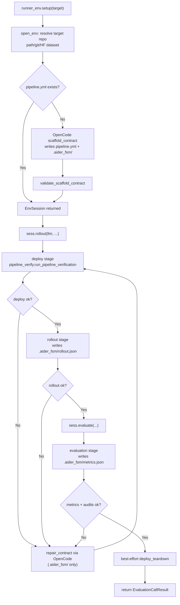

# OpenCode-FSM Runner

A small, auditable **benchmark-agnostic** library for deploying and validating target repos via a repo-owned contract (`pipeline.yml` + `.aider_fsm/`).

中文：这是一个“目标仓库自带合同（pipeline.yml + .aider_fsm）”的通用执行与验收库。Runner 自身不写 benchmark-specific 逻辑。

## Install

Install OpenCode (CLI) first:

```bash
curl -fsSL https://opencode.ai/install | bash
```

```bash
python3.12 -m venv .venv
source .venv/bin/activate
pip install -r requirements.txt
```

## Environment variables

- Provider credentials depend on your model choice, e.g.:
  - `OPENAI_API_KEY` (for `openai/...`)
  - `OPENAI_API_BASE` (optional; for OpenAI-compatible endpoints)
- OpenCode server auth (optional, if you use `opencode_url` in code):
  - `OPENCODE_SERVER_USERNAME`
  - `OPENCODE_SERVER_PASSWORD`

## Programmatic API (library)

Only supported entrypoints:

```python
import runner_env

sess = runner_env.setup("https://github.com/<owner>/<repo>")
sess.rollout(llm="deepseek-v3.2", mode="smoke", require_samples=True, repair_iters=0)
res = sess.evaluate(mode="smoke", repair_iters=0)
print(res.ok, res.metrics)
```

Notes:

- `sess.rollout()` requires an explicit `llm=...` (remote model id/name, or a local model dir path).
- `sess.evaluate()` can reuse the session LLM from `rollout()`, or accept `llm=...` as a convenience (for one-shot runs).
- `sess.evaluate()` performs a best-effort teardown automatically at the end (no public teardown API).

## Flow (high-level)

中文说明：整体运行流程是“以目标仓库自带合同为准”的闭环执行。你通过 `runner_env.setup(target)` 传入一个 repo URL/本地路径（或 HF 数据集快照）后，runner 会先解析/打开目标环境并尝试加载 `pipeline.yml`；如果目标仓库缺少 `pipeline.yml`，会调用 OpenCode 生成最小可运行的 scaffold 合同（写入 `pipeline.yml` 与 `.aider_fsm/` 目录）并做基本校验。随后返回 `EnvSession`，`sess.rollout(llm, ...)` 会按合同执行 deploy（可先跑 `.aider_fsm/bootstrap.yml` 做环境准备）并要求 deploy 写出 `.aider_fsm/runtime_env.json`，再执行 rollout 并写出 `.aider_fsm/rollout.json`（需要时包含 samples JSONL）；任何阶段失败时会进入“repair 重试”循环：runner 触发 OpenCode 只在 `.aider_fsm/` 下修复脚本/配置并重新验证。最后 `sess.evaluate(...)` 按合同运行 evaluation/benchmark 并写出 `.aider_fsm/metrics.json`（必要时还要生成 `.aider_fsm/hints_used.json` 证明执行过官方命令），验证通过后做 best-effort 的 deploy teardown。整个过程中 runner 会把每次 attempt 的 stdout/stderr、验证结果与 provenance 证据落盘到 `.aider_fsm/artifacts/<run_id>/...`，以便审计与复现。



## `.aider_fsm/` contract files (target repo)

中文说明：`.aider_fsm/` 是目标仓库的“合同工作区”。合同的输入（脚本/配置）与输出（JSON 结果与证据）都尽量落在这个目录里，方便 runner 做验收、审计与复现。

Stage 脚本（通常会被 `pipeline.yml` 直接调用）：

- `.aider_fsm/stages/tests.sh`: 运行目标仓库的测试（或最小自检），用于 `tests` stage。
- `.aider_fsm/stages/deploy_setup.sh`: 启动服务/准备运行环境；应写出 `.aider_fsm/runtime_env.json`（JSON object）。
- `.aider_fsm/stages/deploy_health.sh`: 健康检查；应读取并验证 `.aider_fsm/runtime_env.json` 指向的服务是否可用。
- `.aider_fsm/stages/deploy_teardown.sh`: 停止服务/清理资源；建议幂等（重复执行也安全）。
- `.aider_fsm/stages/rollout.sh`: 产生 rollout 产物；应写出 `.aider_fsm/rollout.json`（并在需要时生成 samples JSONL）。
- `.aider_fsm/stages/evaluation.sh`: 产生评测指标；应写出 `.aider_fsm/metrics.json`（或 `pipeline.yml` 指定的 metrics_path）。
- `.aider_fsm/stages/benchmark.sh`: 可选的基准跑分 stage；若启用，应写出对应的 metrics JSON。

配置文件（可选，repo-owned）：

- `.aider_fsm/bootstrap.yml`: 环境准备步骤（如创建 venv、安装依赖、预热缓存）。注意：不要把 `pytest/benchmark` 之类的“评测/测试运行”放到 bootstrap 里，应该放在 pipeline stages。
- `.aider_fsm/actions.yml`: 一次性“动作清单”（例如写入 `.env`、安装依赖、warmup）。runner 会按顺序执行并落盘证据，结束后会 best-effort 删除该文件。

运行输出（run-generated，通常不建议提交到 git）：

- `.aider_fsm/runtime_env.json`: deploy 输出的运行时连接信息（例如 `inference.openai_base_url/base_url`、`inference.model`、`service.base_url` 等）。runner 会用它做 best-effort 的推理端点/模型推断，并把其路径通过 `AIDER_RUNTIME_ENV_PATH` 暴露给后续 stage。
- `.aider_fsm/rollout.json`: rollout 输出的 JSON 对象；推荐包含 `paths.samples_jsonl` 指向样本 JSONL（每行含 `prompt/completion/reward`）。
- `.aider_fsm/metrics.json`: evaluation/benchmark 输出的指标 JSON；当 pipeline 要求 `required_keys` 时 runner 会做键存在性校验；若包含 `ok`，还会要求 `ok=true`（避免“占位成功”）。
- `.aider_fsm/hints_used.json`: 当存在 doc/CI hints 且 `AIDER_FSM_REQUIRE_HINTS=1` 时要求写出，用于证明“至少运行过一个官方/提示命令”（含 `ok/used_anchors/commands/reason`）。
- `.aider_fsm/hints_run.json`: hints 执行的调试追踪（可选但强烈建议保留），用于定位为什么某些 hints 失败/被跳过。

证据目录（runner-managed）：

- `.aider_fsm/artifacts/<run_id>/...`: 每次运行的可审计证据（stdout/stderr、stage summary、验证结果等）。库 API 默认写在 `.aider_fsm/artifacts/<run_id>/env_api/**`。
- `.aider_fsm/artifacts/*/scaffold/scaffold_provenance.json`: scaffold 合同的溯源报告（哪些合同文件被写入/修改、来源是谁）。
- `.aider_fsm/artifacts/*/repair_*/repair_provenance.json`: repair 合同的溯源报告（若发生 repair）。
- `.aider_fsm/venv/`:（可选）推荐的 repo 内隔离虚拟环境目录，通常由 `.aider_fsm/bootstrap.yml` 创建并通过 `PATH` 覆盖让后续 stage 使用该环境。

## OpenCode server (optional)

Start a server in your target repo root:

```bash
OPENCODE_SERVER_PASSWORD=... opencode serve --hostname 127.0.0.1 --port 4096
```

Then point `setup()` at it:

```python
import runner_env

sess = runner_env.setup(
    "https://github.com/<owner>/<repo>",
    opencode_url="http://127.0.0.1:4096",
    opencode_model="opencode/gpt-5-nano",
)
```

## Docs

- `docs/README.md` (中文索引)
- `docs/overview.md`
- `docs/env_api.md`
- `docs/pipeline_spec.md`
- `docs/bootstrap_spec.md`
- `docs/metrics_schema.md`
- `docs/security_model.md`
- `docs/integration.md`
- `docs/verification.md`

## Tests

```bash
pytest -q
```
